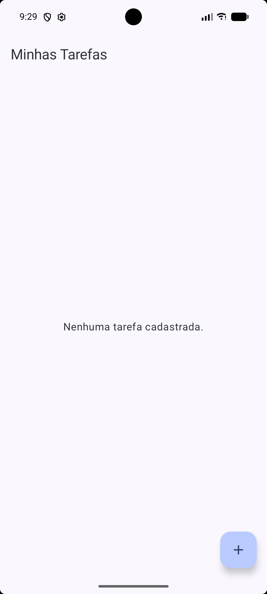
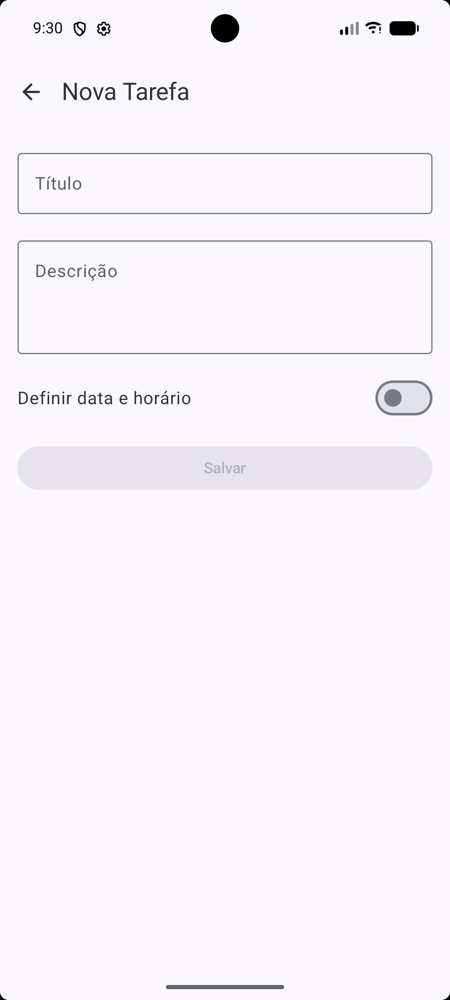
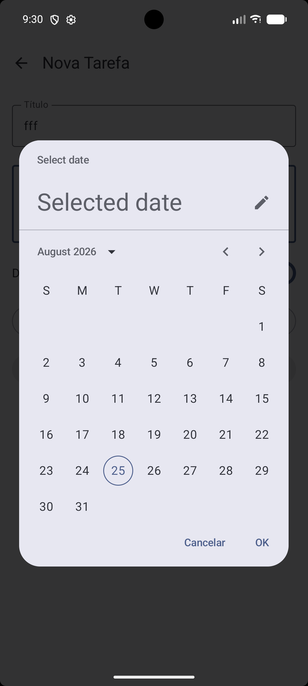
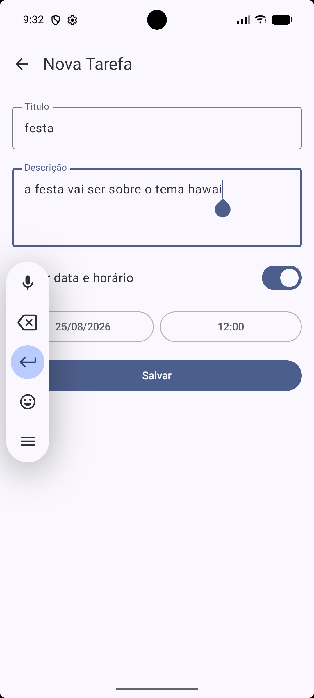
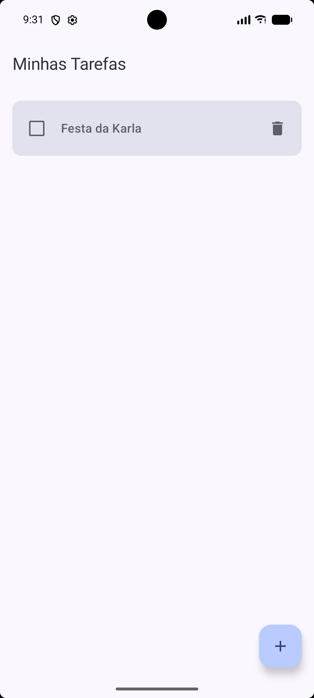
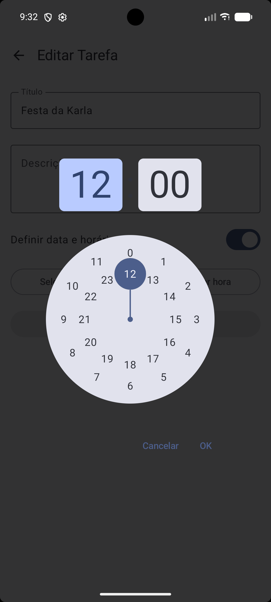
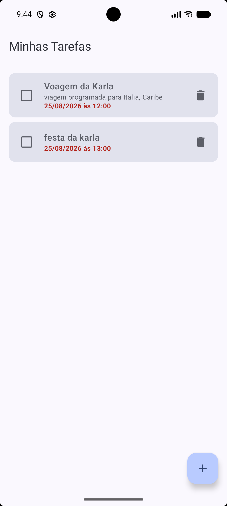
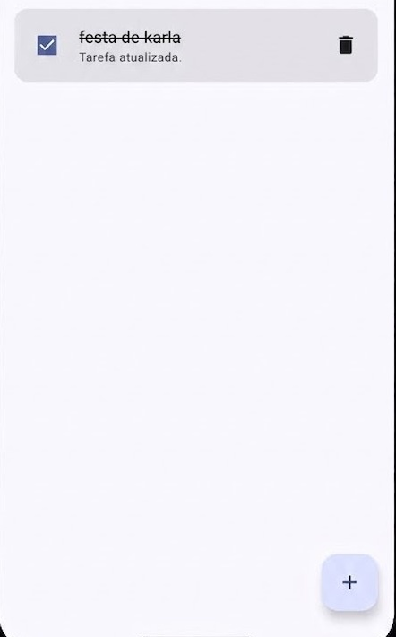

# FIAP To-Do List

Aplicativo Android de lista de tarefas desenvolvido como atividade individual da FIAP, com o objetivo de evoluir o projeto base disponibilizado pelo professor implementando a camada de apresentação (UI), a navegação entre telas e a ViewModel, integrando tudo com a arquitetura de persistência (Room) já existente.

O app permite ao usuário:

- Visualizar todas as tarefas cadastradas em uma lista.
- Cadastrar uma nova tarefa, com título, descrição e, opcionalmente, data e horário.
- Editar uma tarefa já existente.
- Marcar uma tarefa como concluída (ou desmarcar).
- Excluir uma tarefa.
- Navegar entre a tela de lista e a tela de formulário sem sair do aplicativo.

## Tecnologias utilizadas

- **Kotlin** — linguagem principal do projeto.
- **Jetpack Compose** — construção declarativa da interface (telas, componentes, previews).
- **Room** — persistência local dos dados em banco SQLite.
- **Coroutines / Flow** — operações assíncronas e observação reativa dos dados vindos do banco.
- **ViewModel (Architecture Components)** — retenção de estado da UI e ponte entre a interface e os dados.
- **Navigation Compose** — navegação entre as telas do app.

## Arquitetura

O projeto segue o padrão **MVVM (Model-View-ViewModel)**, com uma camada de repositório entre a ViewModel e a fonte de dados:

```
UI (Compose) → ViewModel → Repository → DAO (Room) → Banco de dados local
```

### `TarefaRepository`

Fica em `repository/TarefaRepository.kt`. É a camada responsável por abstrair a origem dos dados para o restante do app — a ViewModel não sabe (e não precisa saber) que os dados vêm do Room, ela só conversa com o `TarefaRepository`.

Suas responsabilidades:

- Expor `tarefas`, um `Flow<List<Tarefa>>` obtido diretamente do `TarefaDao.listarTodas()`, permitindo que quem observar receba automaticamente a lista atualizada sempre que o banco mudar.
- Encaminhar as operações de escrita (`inserir`, `atualizar`, `deletar`) para o DAO, todas como funções `suspend` (executadas fora da thread principal).

Se um dia o app trocar Room por outra fonte (API remota, por exemplo), só o repositório precisaria mudar — a ViewModel e as telas continuariam iguais.

### `TarefaViewModel`

Fica em `viewmodel/TarefaViewModel.kt`. É quem conecta a UI ao `TarefaRepository` e sobrevive a mudanças de configuração (como rotação de tela), sem perder estado.

Suas responsabilidades:

- Transformar o `Flow` do repositório em um `StateFlow` (`tarefas`), usando `stateIn` com `SharingStarted.WhileSubscribed(5_000)` — ou seja, o Flow fica "ativo" enquanto houver alguém observando (a tela), e continua ativo por mais 5 segundos após a última observação parar, evitando recriações desnecessárias durante recomposições rápidas.
- Expor as funções `inserir`, `atualizar` e `deletar`, cada uma abrindo uma corrotina em `viewModelScope.launch` para chamar o repositório sem bloquear a thread principal.
- Fornecer uma **Factory** (`TarefaViewModel.factory(context)`), já que o `TarefaViewModel` precisa receber um `TarefaRepository` no construtor (que por sua vez precisa do `TarefaDao`) — e o Android não sabe construir isso sozinho por padrão. A Factory monta a cadeia completa: `TarefaDatabase.getDatabase(context).tarefaDao()` → `TarefaRepository` → `TarefaViewModel`.

### `ListaTarefasScreen`

Fica em `ui/ListaTarefasScreen.kt`. É a tela inicial do app.

Como observa o estado: usa `viewModel.tarefas.collectAsStateWithLifecycle()`, que assina o `StateFlow` da ViewModel respeitando o ciclo de vida da tela — a lista de tarefas (`List<Tarefa>`) é recomposta automaticamente sempre que muda no banco.

Como dispara ações: cada `Tarefa` é exibida em um `TarefaItem` dentro de uma `LazyColumn`, e cada interação do usuário chama uma função recebida por parâmetro, que por sua vez aciona a ViewModel:

- Marcar/desmarcar o `Checkbox` → chama `onCheckedChange`, que faz `viewModel.atualizar(tarefa.copy(concluida = ...))`.
- Clicar no ícone de lixeira → chama `onDeletar`, que faz `viewModel.deletar(tarefa)`.
- Clicar no card da tarefa → chama `onEditarTarefa(tarefa.id)`, que aciona a navegação para o formulário em modo edição.
- Clicar no `FloatingActionButton` (+) → chama `onNovaTarefa`, que navega para o formulário em modo cadastro.

Também trata o estado vazio (mensagem "Nenhuma tarefa cadastrada.") e inclui `@Preview`s para lista vazia, lista com tarefas, e os diferentes estados visuais de um item (pendente, concluído, com prazo futuro e atrasado).

### `FormularioTarefaScreen`

Fica em `ui/FormularioTarefaScreen.kt`. É usada tanto para **cadastrar** quanto para **editar** uma tarefa — a mesma tela atende aos dois casos.

Como diferencia cadastro de edição: a tela recebe um `tarefaId: Int`. Se `tarefaId == 0`, é uma tarefa nova (`isEdicao = false`); qualquer outro valor é tratado como o ID de uma tarefa existente (`isEdicao = true`). Nesse segundo caso, a tela busca a tarefa correspondente na lista observada da ViewModel e usa seus valores (título, descrição, data/hora) para pré-preencher os campos do formulário. Ao salvar, se for edição, os dados são atualizados na tarefa existente (mantendo o `id`); se for cadastro, uma nova `Tarefa` é criada e inserida.

O formulário também permite ativar/desativar a definição de data e horário (`Switch`), abrindo um `DatePicker` e um `TimePicker` do Material3 quando habilitado, e usa as funções utilitárias de `util/DataHoraUtil.kt` para converter entre os formatos de data usados pelos pickers (UTC) e o timestamp salvo no banco.

Ao concluir o salvamento, chama `onVoltar()` para retornar à tela de lista.

### `AppNavigation`

Fica em `navigation/AppNavigation.kt`. Define as rotas do app usando Navigation Compose:

- `"lista"` → exibe a `ListaTarefasScreen`, é o destino inicial (`startDestination`).
- `"formulario/{tarefaId}"` → exibe a `FormularioTarefaScreen`, recebendo o `tarefaId` como argumento de rota.

A passagem do ID acontece assim:

- Para uma **nova tarefa**, a lista navega para `"formulario/0"` (o `0` indica "sem tarefa existente").
- Para **editar** uma tarefa, a lista navega para `"formulario/$id"`, com o ID real da tarefa clicada.
- Dentro da rota do formulário, o ID é lido de `backStackEntry.arguments` e convertido para `Int` (com fallback para `0` caso não exista), e repassado para `FormularioTarefaScreen`.

O botão de voltar do formulário chama `navController.popBackStack()`, retornando à tela de lista sem empilhar uma nova instância.

### `MainActivity`

Fica em `MainActivity.kt`. É o ponto de entrada do app.

No `onCreate`, ela:

1. Cria a `TarefaViewModel` usando `viewModel(factory = TarefaViewModel.factory(applicationContext))` — a Factory monta toda a cadeia Repository/DAO/Database por trás dos panos.
2. Envolve o conteúdo no tema do app (`FiaptodolistprojectTheme`).
3. Chama `AppNavigation(viewModel = viewModel)`, iniciando a navegação a partir da tela de lista.

O conteúdo de exemplo gerado pelo template padrão do Android Studio foi totalmente substituído por essa integração.

## Como executar o projeto

1. Abra a pasta do projeto no **Android Studio** (versão recente, compatível com AGP 9.x e Kotlin 2.2).
2. Aguarde o Gradle sincronizar automaticamente (ou clique no ícone de sincronização, caso não aconteça sozinho).
3. Selecione um emulador ou conecte um dispositivo físico com Android 7.0 (API 24) ou superior.
4. Clique em **Run ▶** (ou `Shift + F10`) para compilar e instalar o app.

Não é necessária nenhuma configuração adicional — o banco de dados (Room) é criado automaticamente na primeira execução.

## Evidências

As imagens abaixo demonstram o funcionamento do aplicativo, capturadas durante a execução em um dispositivo/emulador.

### Tela inicial com a lista de tarefas



Estado inicial do app, sem nenhuma tarefa cadastrada.

### Cadastro de uma nova tarefa



Tela de cadastro, acessada pelo botão flutuante (+) na lista.



Seleção de data pelo `DatePicker` ao ativar a opção "Definir data e horário".



Formulário preenchido com título, descrição e data/horário definidos, pronto para salvar.

### Tarefa cadastrada aparecendo na lista



Após salvar, a tarefa "Festa da Karla" passa a aparecer na lista.

### Edição de uma tarefa existente



Tela de edição (`Editar Tarefa`) aberta a partir do clique na tarefa já cadastrada, ajustando o horário pelo `TimePicker`.

### Lista com múltiplas tarefas



Lista exibindo duas tarefas cadastradas, cada uma com sua data e horário.

### Tarefa marcada como concluída



Tarefa "festa de karla" marcada como concluída — o checkbox aparece marcado e o título é exibido com risco (`TextDecoration.LineThrough`), refletindo o estado `concluida = true`.


